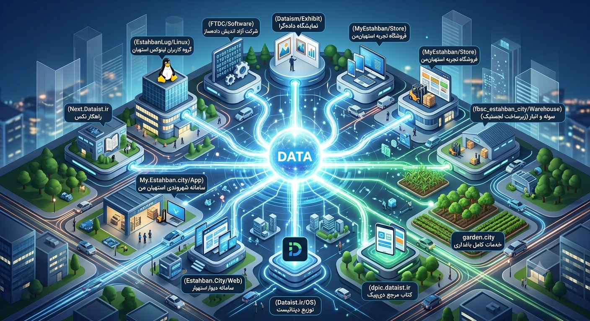

.. meta::
   :description: نقشه‌راه جامع، گام‌های اجرایی ۱۱گانه و چارت کلی خدمات فنی، لجستیکی و اقتصادی اکوسیستم دیتائیست و پروژه کتاب مرجع دی‌پیک.
   :keywords: نقشه‌راه دیتائیست, گام‌های اجرایی استهبان‌من, لاگ استهبان, شرکت آزاداندیش داده‌ساز, دیتائیسم, کتاب دی‌پیک, مانیتورینگ دیتائیست

چارت کلی خدمات و سرویس‌های قابل‌ارائه
========================================================================

این بخش خلاصه و نقشه‌راه خدمات و سرویس‌های توسعه‌یافته در اکوسیستم دیتائیست را نشان می‌دهد.

----------

EstahbanLug | گروه کاربران لینوکس استهبان
------------------------------------------------------------------------

**گام اول:** اوایل سال ۲۰۲۲ با تأسیس گروه کاربران گنو/لینوکس استهبان توانستیم کمبود نیروی متخصص و فنی در سطح شهرستان را جبران کنیم. لاگ استهبان تبدیل به موتور محرک تربیت نیروی متخصص شد. در حال حاضر کلاس‌ها و کارگاه‌های مقدماتی و تخصصی در سطح شهر در حال برگزاری هستند. همچنین از بخش بوردهای نکس می‌توانید تمام مسیر طی‌شده و چشم‌انداز آینده لاگ استهبان را مشاهده نمایید. `پروفایل حساب کاربری در نکس دیتائیست <https://next.dataist.ir/u/estahbanlug>`_ `تلگرام <https://t.me/+0KbuCX1ERF1hYmM8>`_ `توییتر <https://x.com/EstahbanLug>`_ `اینستاگرام <https://www.instagram.com/estahban_lug/>`_

FTDC | شرکت آزاداندیش داده‌ساز
------------------------------------------------------------------------

**گام دوم:** برای پیش‌برد مسائل حقوقی و همچنین فراهم‌آوردن زیرساخت نرم‌افزاری و توسعه ابزارها، شرکت نرم‌افزاری «آزاداندیش داده‌ساز» ثبت شد. `پروفایل حساب کاربری شرکت در نکس دیتائیست <https://next.dataist.ir/u/ftdc>`_ `صفحه مانیتورینگ سرویس‌های در دسترس <https://status.dataist.ir/status/heuristic>`_

Dataism | نمایشگاه داده‌گرا
------------------------------------------------------------------------

**گام سوم:** مفهومی با عنوان دیتائیسم (داده‌گرایی) وجود دارد. شما می‌توانید با جمع‌آوری داده از خود، به خودشناسی داده‌محور دست پیدا کنید. با فلسفه داده‌گرایی و دارابودن ابزارهای عموماً نرم‌افزاری می‌توانید نه تنها دید بهتری نسبت به خود، بلکه چشم‌اندازی نسبت به تحلیل رفتار مشتریان کسب‌وکارتان داشته باشید. از این رو، جهت فرهنگ‌سازی و آگاه‌سازی، به‌صورت سالیانه نمایشگاه‌هایی در سطح شهر برپا خواهند شد. این نمایشگاه پروموت‌کننده سیستم‌عامل (توزیع) دیتائیست نیز خواهد بود. `پروفایل حساب کاربری در نکس دیتائیست <https://next.dataist.ir/u/dataism>`_

MyEstahban | فروشگاه تجربه‌محور استهبان‌من
------------------------------------------------------------------------

**گام چهارم:** در سطح شهرستان استهبان چند شعبه فروشگاه لوازم خانگی و پلاستیکی با چند دهه فعالیت، در حال تبدیل‌شدن به «فروشگاه حضوری تجربه‌محور کالای دیجیتال» هستند. مشتریان می‌توانند قبل از خرید آنلاین، با حضور در یکی از فروشگاه‌های حضوری ما، کالاهای مورددلخواه خود را تست کنند و پس از پسندکردن، از طریق «اپلیکیشن شهروندی استهبان‌من» سفارش خود را ثبت کنند تا درب منزل یا در محل به صورت بسته تحویل بگیرند. `پروفایل حساب کاربری در نکس دیتائیست <https://next.dataist.ir/u/myestahbanexperiential>`_

fbsc_estahban_city | سوله و انبار (زیرساخت لجستیک)
------------------------------------------------------------------------

**گام پنجم:** دو سوله برای انبار کالا (تأمین بخش فروشگاه در مرکز شهر) و پارک موتوری (در بیرون از شهر) مهیا شد.

Estahban.City | سامانه دیوار استهبان
------------------------------------------------------------------------

**گام ششم:** سرویسی در قالب اپلیکیشن و نسخه وب به آدرس اینترنتی https://estahban.city ایجاد و توسعه داده شد. شهروندان بدون محدودیت خواهند توانست محصولات و خدمات خود را در این سامانه تبلیغ کنند. کسب‌وکارهای طرف قرارداد ما در این سرویس به‌صورت ویژه پروموت خواهند شد. `وب‌سایت رسمی <https://estahban.city/>`_

Dataist.ir | توزیع دیتائیست
------------------------------------------------------------------------

**گام هفتم:** سیستم‌عامل (توزیع) با عنوان دیتائیست در مخزن رسمی در حال توسعه است. این سیستم‌عامل به کسب‌وکارها، تمام خدمات و ابزارهای موردنیاز نظیر محصولات نرم‌افزاری انبارداری، حسابداری و... را ارائه‌ خواهد داد. کاربران دیتائیست می‌توانند از هرگونه ابزار اضافی برای مدیریت کسب‌وکار خود بی‌نیاز باشند. همچنین همه کسب‌وکارهایی که از این توزیع استفاده می‌کنند، می‌توانند به تحلیل رفتار مشتریان خود جهت درآمدزایی بیشتر اقدام کنند. آموزش استفاده از این توزیع لینوکسی در وب‌سایت رسمی قرار خواهد گرفت. `وب‌سایت رسمی توزیع دیتائیست <https://dataist.ir>`_

Next.Dataist.ir | راهکار نکس
------------------------------------------------------------------------

**گام هشتم:** محصول نرم‌افزاری با عنوان «نکس» در آدرس اینترنتی https://next.dataist.ir در دسترس است. هدف از این سرویس، کمک به توسعه محصولات این اکوسیستم و ارتباطات است. ما در نکس به شما در توسعه کسب‌وکار، آموزش، در اختیار قراردادن جامعه متخصص و راهکار سازمانی مشاوره خواهیم داد. (توضیحات بیشتر در جدول جزئیات زیرساخت نکس قرار دارد). `آدرس نکس دیتائیست <https://next.dataist.ir>`_

My.Estahban.city | سامانه شهروندی استهبان‌من
------------------------------------------------------------------------

**گام نهم:** اپلیکیشن شهروندی «استهبان‌من» در نسخه اپلیکیشن و وب در حال توسعه است. بعد از نصب، کاربر با ویترین استهبان مواجه خواهد شد که نزدیک به صد محصول تولیدی استهبان در آن قرار می‌گیرد. شهروندان مستقر در استهبان می‌توانند با خرید اشتراک ویژه، از خدمات و بخش فروشگاهی بهره‌مند شوند. این پلتفرم در سه بخش (ویترین، فروشگاه محصولات و خدمات غیرفروشگاهی) با سطوح دسترسی مختلف خدمات‌دهی می‌کند. به کاربران این سامانه، کارت فلزی شهروندی تعلق می‌گیرد. `آدرس نسخه وب اپلیکیشن شهروندی استهبان‌من <https://my.estahban.city>`_

garden.city | خدمات کامل باغداری
------------------------------------------------------------------------

**گام دهم:** شرکت باغبانی با خدمات کامل از صفر تا فروش محصولات، جذب توریست و ساخت خانه‌های پیش‌ساخته تأسیس خواهد شد. ۵۰ هکتار زمین اولیه قابل‌باغبانی و یک پارک موتوری برای شروع این شرکت و محصولات نرم‌افزاری برای مدیریت آن مهیا شده است.

dpic.dataist.ir | کتاب دی‌پیک
------------------------------------------------------------------------

**گام یازدهم:** توسعه کتاب جامع و مرجع تخصصی *Dataist Professional Institute Certification* جهت آموزش و مستندسازی کل اکوسیستم. `نسخه آنلاین کتاب دی‌پیک <https://dpic.dataist.ir>`_

.. note::
   سرویس `مانیتورینگ زنده اکوسیستم <https://status.dataist.ir/status/heuristic>`_ جهت پایش پایداری تمامی خدمات فوق به‌صورت متمرکز فعال می‌باشد.
